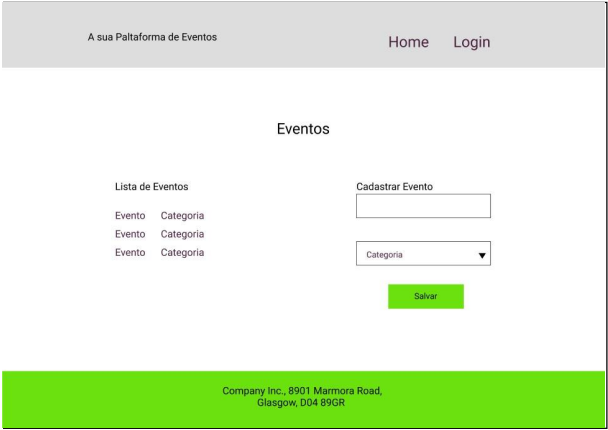
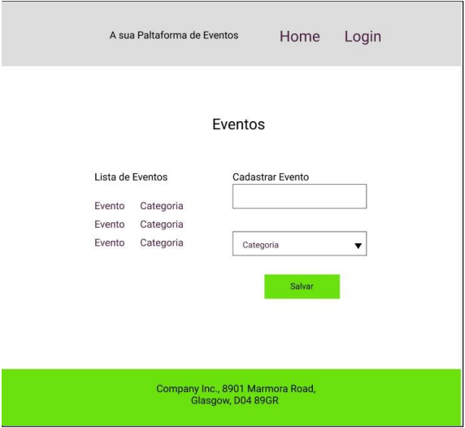
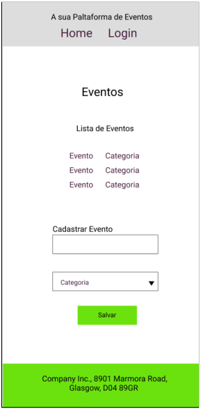

# Exercícios: Responsividade

1- Com base no layout abaixo, crie uma página trabalhando a responsividade para tablet e
smartphone: 
**DESKTOP** 
**main:** 900px;
**Fonte:** Roboto 14px;
**Inputs:** 320px;
**botão:** 128px;
**background:** #6BE20E

**TABLET** 
**main:** 650px;
**Fonte:** Roboto 14px;
**Inputs:** 320px;
**botão:** 128px;

**SMARTPHONE** 
**main:** 320px;
**Fonte:** Roboto 14px;
**Inputs:** 320px;
**botão:** 128px;

2- Revisite o Desafio da Sprint anterior, adicionando responsividade para dispositivos
móveis e tablets, **link para o figma:**
[https://www.figma.com/file/s4ThHsvIUbMyH1e0LSHOSP/Desafio-1_Revisitado](https://www.figma.com/file/s4ThHsvIUbMyH1e0LSHOSP/Desafio-1_Revisitado)
